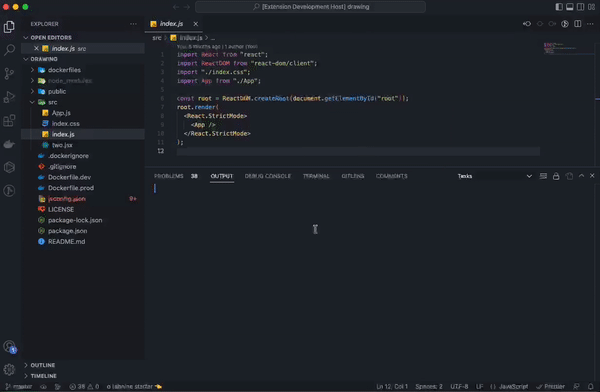
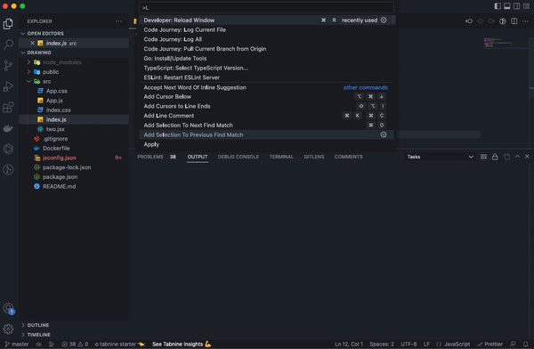

  
   
  <h1>Code Journey</h1>
  <h3>This VSCode Extension takes you on a journey of the developer/organization's code of the Project from the first ever commit written to the latest based on your choices. It helps you understand how a developer through in each step of the project.</h3>

 

> "Talk is cheap. Show me the code" - Linus Torvalds

 

## Features

Currently it is possible to do the following:

- `Code Journey: Init` Initialize a git repository
- `Code Journey: Start Jounrey` Copy the commit history of the project and start your journey into the code
- `Code Journey: What's Next` Move to the next commit of the project from where you are currently at
- `Code Journey: What's Before` Move to the previous commit of the project from where you are currently at
- `Code Journey: Jump to Commit` Jump to a specific commit of the project
- `Code Journey: Pull Current Branch from Origin` Pull current branch from the origin
- `Code Journey: Add Origin` Add an origin to git
- `Code Journey: Add Remote` Add a remote repository to git
- `Code Journey: Change/Checkout Existing Branch` Checkout from an existing branch or change a branch in the project
- `Code Journey: Create New Branch` Create a new branch in the repository
- `Code Journey: Log All` Show all the logs of the repository
- `Code Journey: Log Current File` Show all the commit history of a specific file
- See the difference between the last and the current file in a .diff file

## Start your journey

To use this extension one needs to navigate to the project folder in their VSCode Workspace and execute 'Code Journey: Start Journey' command.

To execute the `Code Journey: Start Journey` command type `Ctrl/Cmd+Shift+p` in VSCode to open the command palette and type `Code Journey: Start Journey`. You will then be reverted to the very earliest commit of the project from where you can traverse and look at how the code progressed.

Additionally, by default this extension assumes the git binary is already available in your machine and a git repository is already initialized for the project. If you wish to initialize a git repository, you can do this by executing `Code Journey: Init`.

There are additional settings for this extension as well, enter `Code Journey` in the Command Palette of VS Code to see them all.

## Code Diff

Check the difference in commit histories in a `.diff` file

 

## Contributors ✨

This project follows the [all-contributors](https://github.com/all-contributors/all-contributors) specification. Contributions of any kind welcome!
